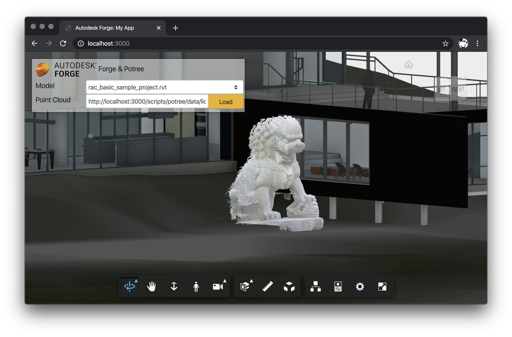

# forge-potree-demo

> Sample Autodesk Forge application showing the use of Potree pointclouds in the viewer.



## Usage

- clone the repository
- install Node.js dependencies: `yarn install`
- configure the following env. variables:
  - `FORGE_CLIENT_ID` - your Forge application client ID
  - `FORGE_CLIENT_SECRET` - your Forge application client secret
- run the serve: `yarn start`

When using Visual Studio Code, consider adding the following configuration to your _.vscode/launch.json_:

```json
{
    "version": "0.2.0",
    "configurations": [
        {
            "type": "node",
            "request": "launch",
            "name": "Launch Server",
            "skipFiles": [
                "<node_internals>/**"
            ],
            "program": "${workspaceFolder}/server.js",
            "env": {
                "FORGE_CLIENT_ID": "<your Forge application client ID>",
                "FORGE_CLIENT_SECRET": "<your Forge application client secret>"
            }
        }
    ]
}
```

## Development

For more information about how the Potree data is loaded here, see [public/scripts/potree/README.md](./public/scripts/potree/README.md).
